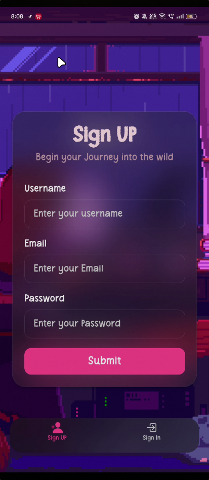
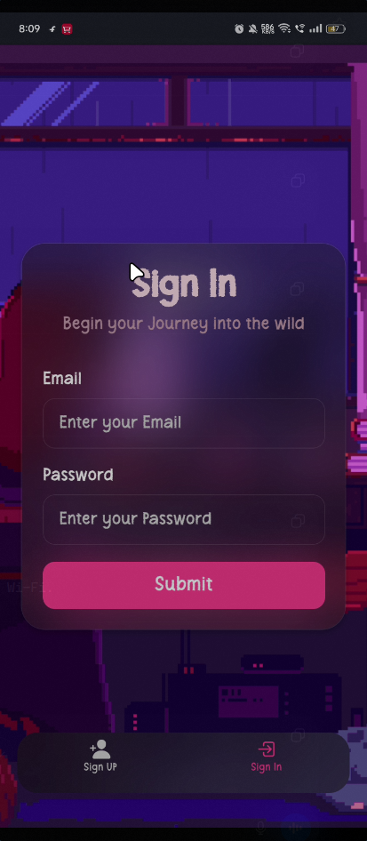

# React Native Authentication App

A modern React Native authentication starter project built with Expo Router, TypeScript, and glassmorphism-inspired UI design. This project includes a clean authentication flow with Sign In and Sign Up screens, reusable styling patterns, and scalable folder architecture.

---



Check the Post where I have shown the project video 
[Twitter Post](https://x.com/_beast0/status/2053109340463313149?s=20)
---

# Features

* Expo Router based navigation
* TypeScript support
* Modern glassmorphism UI
* Responsive mobile layout
* Keyboard-aware forms
* Reusable styling structure
* Safe area support
* Blur effects using Expo Blur
* Tab based navigation structure
* Clean project organization

---

# Tech Stack

## Frontend

* React Native
* Expo
* Expo Router
* TypeScript

## UI & Styling

* React Native StyleSheet
* Expo Blur
* Safe Area Context

---

# Project Structure

```bash
.
├── app
│   ├── (tabs)
│   │   ├── _layout.tsx
│   │   ├── SignIn.tsx
│   │   └── SignUp.tsx
│   └── _layout.tsx
│
├── assets
│
├── scripts
│
├── .expo
├── .vscode
├── app.json
├── eslint.config.js
├── expo-env.d.ts
├── package.json
├── package-lock.json
├── README.md
└── tsconfig.json
```

---

# Screens

## Sign In

The Sign In screen provides:

* Email input
* Password input
* Modern blurred glass card UI
* Keyboard avoiding behavior
* Mobile friendly layout

## Sign Up

The Sign Up screen provides:

* Username input
* Email input
* Password input
* Glassmorphism styled form
* Blur overlay effects
* Responsive design

---

# Styling Architecture

The project uses reusable StyleSheet patterns for scalability and maintainability.

Example:

```tsx
style={[styles.inputBase, styles.inputDark]}
```

---

# Installation

## Clone the repository

```bash
git clone <your-repository-url>
```

## Navigate into the project

```bash
cd sign-up-ui
```

## Install dependencies

```bash
npm install
```

---

# Running the Project

## Start Expo development server

```bash
npx expo start
```

## Run on Android

```bash
npx expo run:android
```

## Run on iOS

```bash
npx expo run:ios
```

---

# Environment Setup

Make sure the following are installed:

* Node.js
* npm
* Expo CLI
* Android Studio or Xcode

---

# Navigation

The project uses Expo Router file-based routing.

Example:

```bash
app/
 ├── (tabs)/
 │    ├── SignIn.tsx
 │    └── SignUp.tsx
```

Routes are automatically generated from the file structure.

---

# UI Design Goals

This project focuses on:

* Clean mobile-first UI
* Smooth authentication experience
* Reusable components
* Scalable architecture
* Modern blur and glass effects
* Maintainable codebase

---

# License

This project is open source and available under the MIT License.
